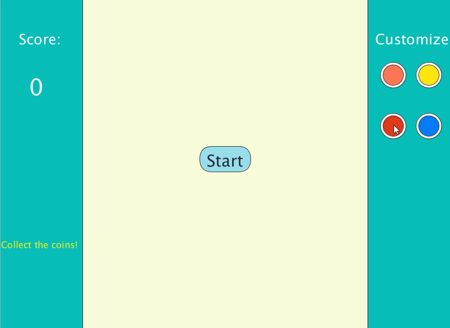

# Coin-collecting-Spaceship-game
A coin-collecting game made with the programming language processing. The objective of the game is to collect as many coins as possible without being hit by the fast-moving obstacles. The player can control their spaceship using a mouse/keypad, and can customize the colors of their spaceship before every round.

## Walkthrough

## Licenses

